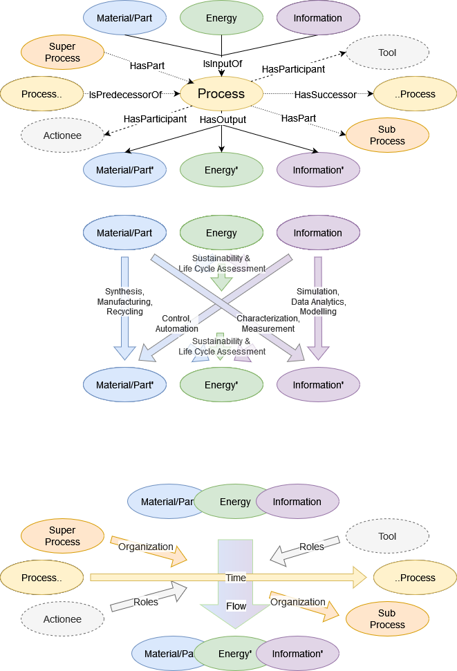
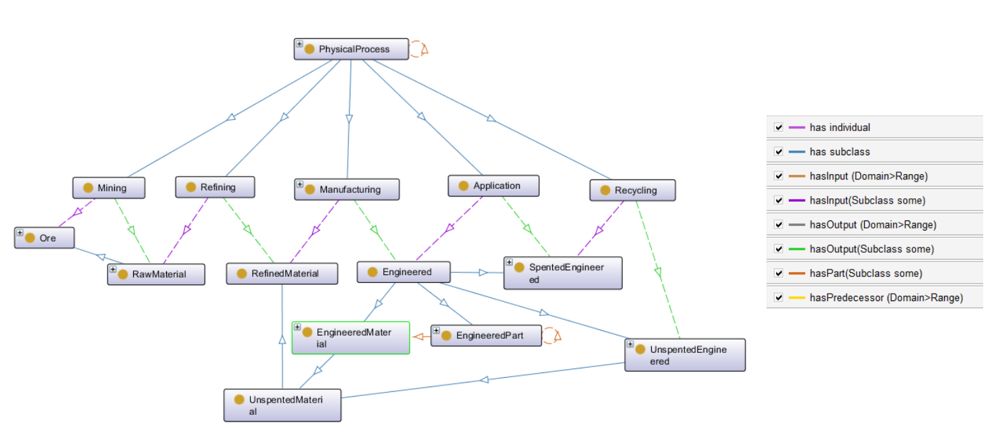
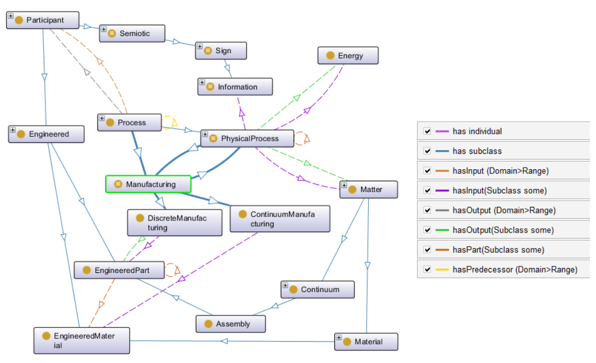

# GPO

General Process Ontology (GPO), work in progress

Public repo: https://github.com/General-Process-Ontology/ontology

## About

Basically, this ontology aims to model processes. Processes are holistic perspective elements that transform inputs/educts (matter, energy, information) into output/products (matter, energy, information) with the help of tools (devices, algorithms). They can be decomposed into sub-processes and have predecessor and successor processes. 

The GPO is a cross-project development under the coordination of Fraunhofer ISC (both EU and national research projects).

Based on EMMO: https://github.com/emmo-repo/EMMO
using Protégé: https://github.com/emmo-repo/EMMO/blob/master/doc/protege-setup.md
and FaCT++-Reasoner: https://github.com/emmo-repo/EMMO/blob/master/doc/installing_factplusplus.md

## Applications
* https://github.com/Battery-Value-Chain-Ontology/ontology
* https://github.com/OpenSemanticLab
* https://kiprobatt.de/wiki: [Example-Graph](https://kiprobatt.de/w/index.php?title=Special:RunQuery&form=LabProcess%2FQuery%2FInteractiveSemanticGraph&target=&OslTemplate%3ALabProcess%2FQuery%2FInteractiveSemanticGraph%5Broot%5D=LabObject%3AOSL924cea524c0648f7a29756b87e4efdef%23O0051%0A&OslTemplate%3ALabProcess%2FQuery%2FInteractiveSemanticGraph%5Bproperties%5D%5B0%5D=-IsSubprocessOf%0A&OslTemplate%3ALabProcess%2FQuery%2FInteractiveSemanticGraph%5Bproperties%5D%5B1%5D=-IsProcessParameterOf%0A&OslTemplate%3ALabProcess%2FQuery%2FInteractiveSemanticGraph%5Bproperties%5D%5B2%5D=-IsObjectParameterOf%0A&OslTemplate%3ALabProcess%2FQuery%2FInteractiveSemanticGraph%5Bproperties%5D%5B3%5D=HasOutput%0A&OslTemplate%3ALabProcess%2FQuery%2FInteractiveSemanticGraph%5Bproperties%5D%5B4%5D=-HasInput%0A&OslTemplate%3ALabProcess%2FQuery%2FInteractiveSemanticGraph%5Bproperties%5D%5B5%5D=-HasOutput%0A&OslTemplate%3ALabProcess%2FQuery%2FInteractiveSemanticGraph%5Bproperties%5D%5B6%5D=-HasObject%0A&OslTemplate%3ALabProcess%2FQuery%2FInteractiveSemanticGraph%5Bproperties%5D%5B7%5D=HasValue%0A&OslTemplate%3ALabProcess%2FQuery%2FInteractiveSemanticGraph%5Bproperties%5D%5Bis_list%5D=1%0A&OslTemplate%3ALabProcess%2FQuery%2FInteractiveSemanticGraph%5Bpermalink%5D%5Bis_checkbox%5D=true%0A&OslTemplate%3ALabProcess%2FQuery%2FInteractiveSemanticGraph%5Bautoexpand%5D%5Bis_checkbox%5D=true%0A&OslTemplate%3ALabProcess%2FQuery%2FInteractiveSemanticGraph%5Bautoexpand%5D%5Bvalue%5D=%0A&OslTemplate%3ALabProcess%2FQuery%2FInteractiveSemanticGraph%5Bdepth%5D=50%0A&_run=)

## Details

### Value Chain

### Manufacturing

## License

The General Process Ontology is released under the [Creative Commons Attribution 4.0 International](https://creativecommons.org/licenses/by/4.0/legalcode) license (CC BY 4.0).
